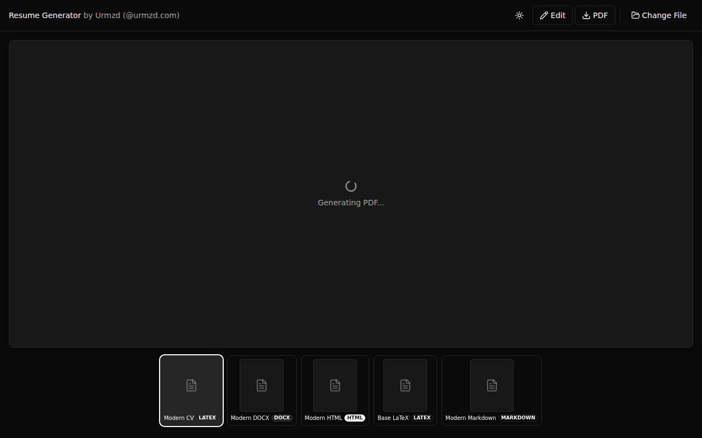
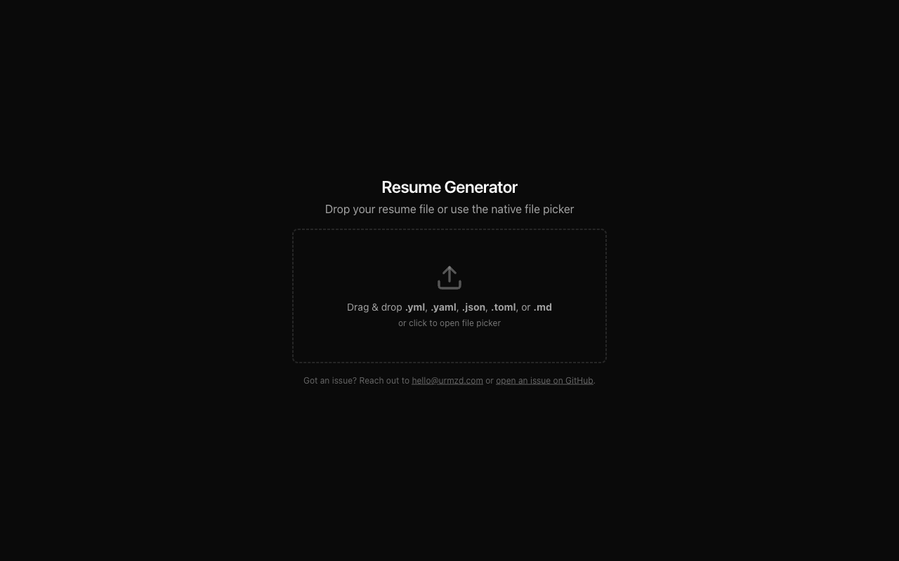
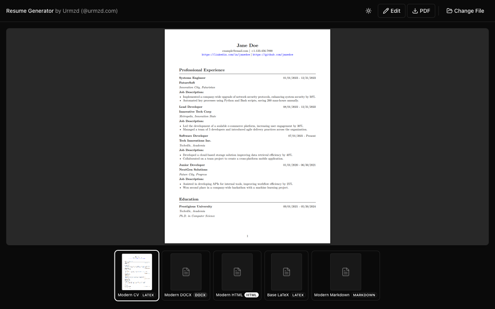
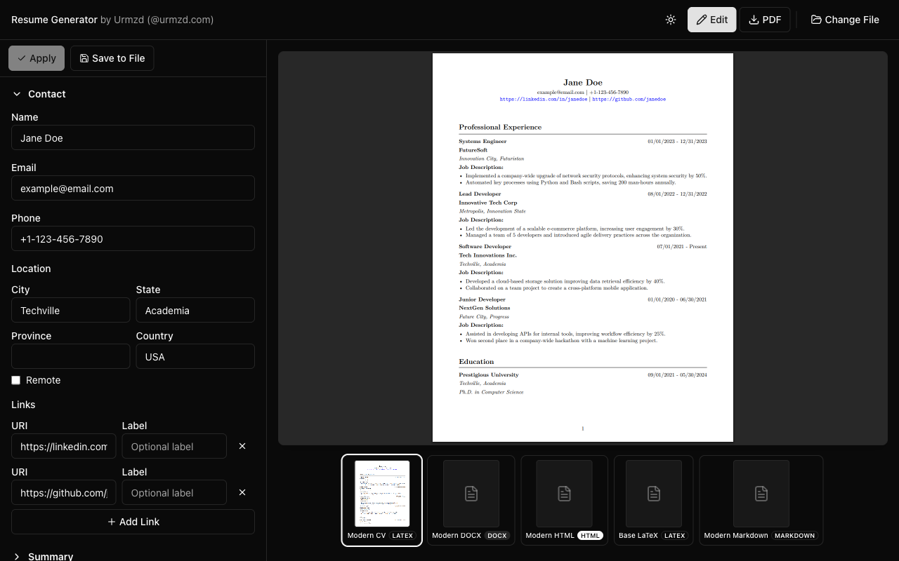
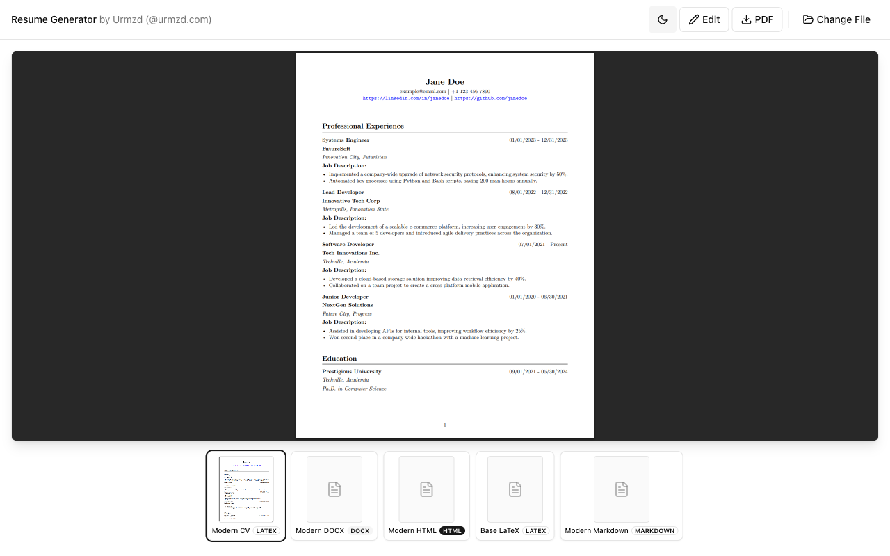
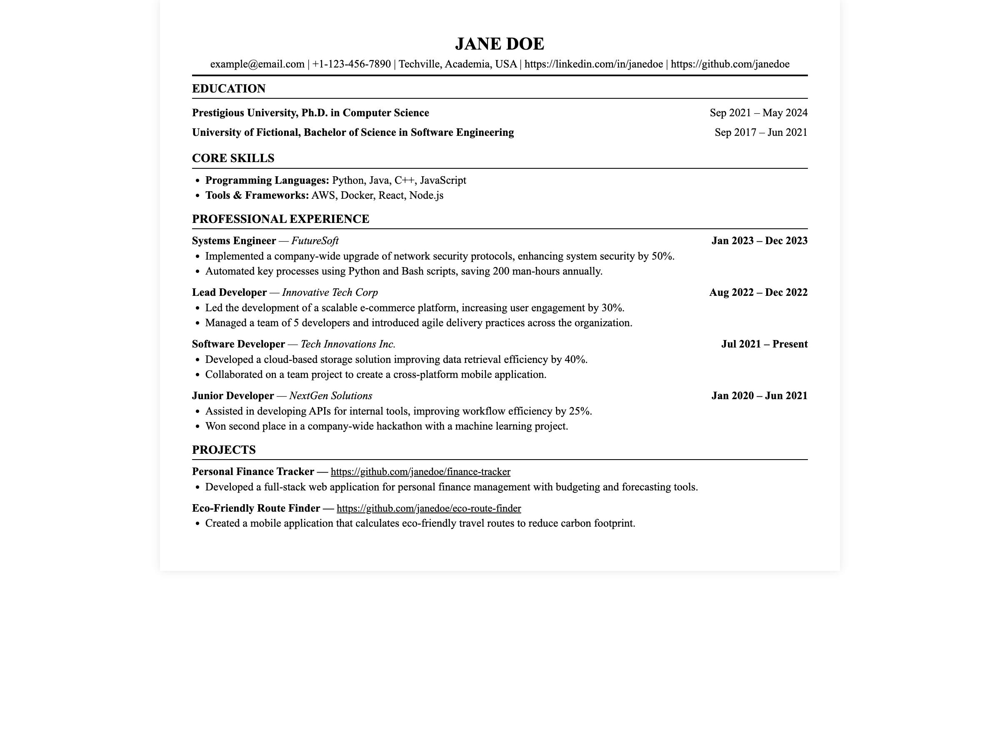

<p align="center">
  <h1 align="center">Resume Generator App</h1>
  <p align="center">
    A native desktop app for building polished resumes with live PDF preview, template gallery, and inline editing.
    <br />
    Built with <a href="https://wails.io">Wails</a>, <a href="https://react.dev">React</a>, and <a href="https://tailwindcss.com">Tailwind CSS</a>.
    <br /><br />
    <a href="https://github.com/urmzd/resume-generator-app/releases">Download</a>
    &middot;
    <a href="https://github.com/urmzd/resume-generator-app/issues">Report Bug</a>
    &middot;
    <a href="https://github.com/urmzd/resume-generator">CLI Version</a>
  </p>
</p>

<br />

<p align="center">
  
</p>

## Showcase

<table>
  <tr>
    <td align="center" width="50%">
      
      <br /><em>Drop page</em>
    </td>
    <td align="center" width="50%">
      
      <br /><em>Gallery with live preview</em>
    </td>
  </tr>
  <tr>
    <td align="center" width="50%">
      
      <br /><em>Inline editor</em>
    </td>
    <td align="center" width="50%">
      
      <br /><em>Light mode</em>
    </td>
  </tr>
</table>

### Template Output

<p align="center">
  
  &nbsp;
  
  &nbsp;
  
</p>
<p align="center">
  <em>Modern HTML &nbsp;&middot;&nbsp; Modern LaTeX &nbsp;&middot;&nbsp; Modern CV</em>
</p>

## Features

### Preview & Gallery

- **Live PDF Preview** — see your resume rendered in real time as you switch templates
- **Template Gallery** — browse and compare all templates via scrollable thumbnail strip with format badges (HTML, LaTeX, DOCX, Markdown)
- **Background Pre-generation** — all template PDFs are generated in the background so switching is instant
- **Page Count Warnings** — alerts you when your resume exceeds 1 page with a suggestion to use compact density
- **Keyboard Navigation** — use arrow keys to browse templates, Enter/Space to select

### Inline Editor

- **Full Resume Editing** — edit every field directly in the app: contact info, summary, experience, education, skills, projects, certifications, and languages
- **Layout Customization** — adjust density (compact/normal/comfortable), typography (sans/serif/mono), header alignment (left/center/compact), skill columns, and section ordering
- **Real-time Validation** — field-level errors displayed instantly as you type
- **Apply & Save** — apply changes to regenerate previews, or save back to the original file on disk
- **Collapsible Sections** — accordion-style editor keeps things organized

### File Handling

- **Drag & Drop** — drop `.yml`, `.yaml`, `.json`, `.toml`, or `.md` files onto the window
- **Native File Picker** — OS-level file dialog for opening resume files
- **Save to File** — persist edits back to the original resume file
- **Format Validation** — clear error messages for unsupported file types

### Export

- **PDF** — export any template as PDF via native save dialog
- **DOCX** — export Word documents (when a DOCX template is selected)
- **HTML / LaTeX** — export raw source files for further customization

### Appearance

- **Dark & Light Mode** — toggle with one click, persists across sessions
- **Cross-Platform** — runs on macOS, Linux, and Windows

### CLI Fallback

Pass any arguments to use the full [resume-generator CLI](https://github.com/urmzd/resume-generator) — the app binary includes all CLI commands (run, validate, templates, assess, etc.).

## Install

### Pre-built Binaries

```bash
curl -fsSL https://raw.githubusercontent.com/urmzd/resume-generator-app/main/install.sh | bash
```

- **macOS**: installs the `.app` bundle to `/Applications`
- **Linux**: installs the binary to `~/.local/bin`
- **Windows**: download from the [Releases](https://github.com/urmzd/resume-generator-app/releases) page

### Build from Source

**Prerequisites:** Go 1.24+, Node.js 22+, [Wails CLI](https://wails.io/docs/gettingstarted/installation)

```bash
git clone https://github.com/urmzd/resume-generator-app.git
cd resume-generator-app
just init    # install deps + Playwright
just build   # production binary → build/bin/
```

## Usage

Launch the app (no arguments) to open the GUI:

```bash
./build/bin/resume-generator-app
```

1. **Open** a resume file via drag-and-drop or the file picker
2. **Browse** templates in the gallery strip — thumbnails update as PDFs generate in the background
3. **Edit** content with the inline editor panel (click "Edit" in the header)
4. **Customize layout** — adjust density, typography, header style, and section order
5. **Export** as PDF, DOCX, HTML, or LaTeX

## Development

```bash
just dev          # Wails dev server with hot reload
just dev-clean    # clean caches, rebuild frontend, then dev
just demo-desktop # run e2e tests and capture screenshots + video
```

## Data Format

Resume data is defined in YAML, JSON, or TOML. See [`assets/example_resumes/software_engineer.yml`](assets/example_resumes/software_engineer.yml) for a complete example.

The data model is provided by the [resume-generator](https://github.com/urmzd/resume-generator) library, which this app depends on for all generation logic.

## Architecture

```
resume-generator-app
├── main.go          # Entry point — Wails app (no args) or CLI fallback (with args)
├── app.go           # Go backend: file I/O, template listing, PDF generation, validation
├── templates.go     # Embedded template FS
├── templates/       # Resume templates (html, latex, docx, markdown)
├── frontend/        # React + TypeScript + Tailwind UI
│   └── src/
│       ├── pages/         # DropPage, GalleryPage
│       ├── components/    # PdfViewer, ThumbnailStrip, AppHeader, ThemeToggle
│       │   └── editor/    # Contact, Experience, Education, Skills, Projects,
│       │                  # Certifications, Languages, Layout, Summary editors
│       ├── containers/    # GalleryContainer (PDF caching, background generation)
│       ├── hooks/         # useResumeEditor (draft state, validation, save)
│       └── lib/           # Theme provider, PDF cache, utilities
├── tests/e2e/     # Playwright e2e tests + demo recording
└── scripts/         # Shell scripts for dev tasks
```

## Related

- [resume-generator](https://github.com/urmzd/resume-generator) — lightweight CLI for CI pipelines, scripting, and server environments (no GUI dependencies)

## License

Apache 2.0
